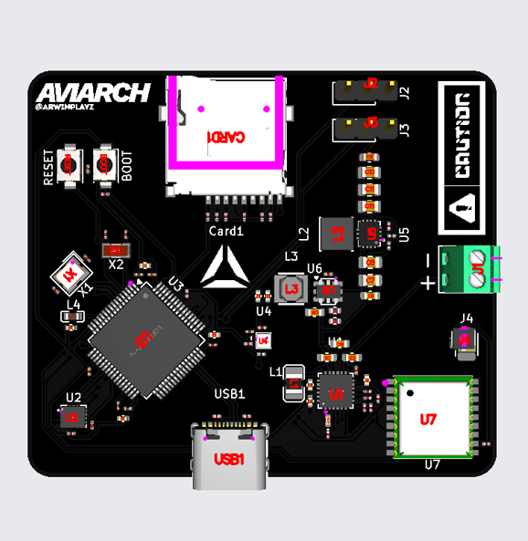
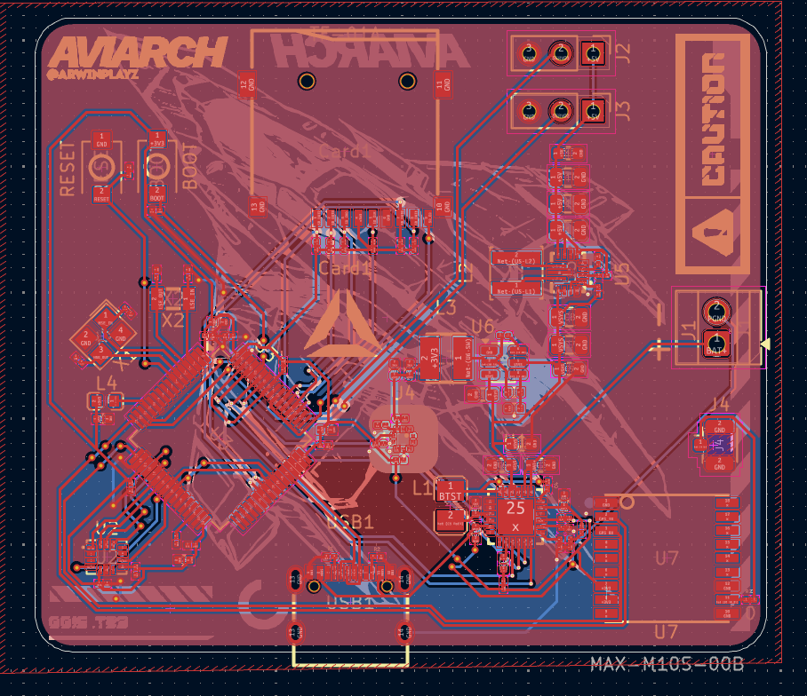
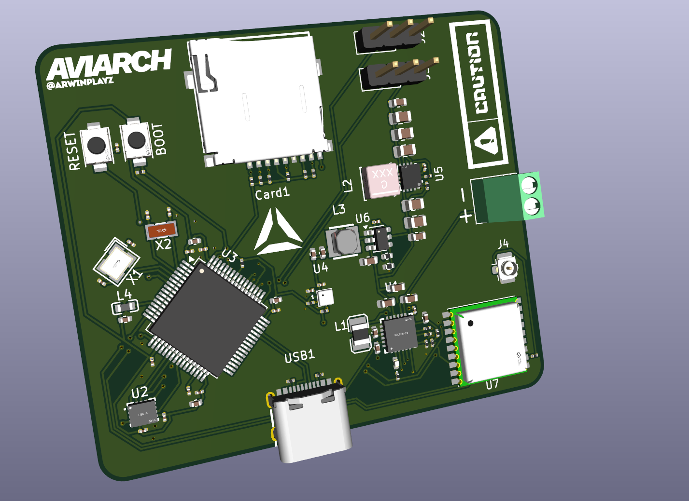

# Custom Flight Controller
Description
This project is a custom rocket flight controller designed in KiCad for Thrust Vector Control (TVC) Rockets. The board is responsible for controlling servos that adjust the rocket's thrust direction, allowing the rocket to stabilise and guide itself during flight.

How to Use the Project
The flight controller is designed to be manufactured from the provided PCB files and assembled with the required components. Once assembled, firmware can be uploaded to the microcontroller. The board can then be added into a rocket system where it processes flight data in real time and adjusts the thrust vector to stabilise and guide the rocket.

Why I Made the Project
I created this project to learn more about electronics, PCB design, and TVC. Designing a flight controller provided me with new experience on hardware design, control systems, and how to use kicad properly.

The goal was to build a controller specifically suited for TVC rockets allowing me to understand how rocket control systems work.
---

## Screenshots

### 1. Overall
  

### 2. Schematic
  

### 3. PCB layout
  

### 4. Design
  

